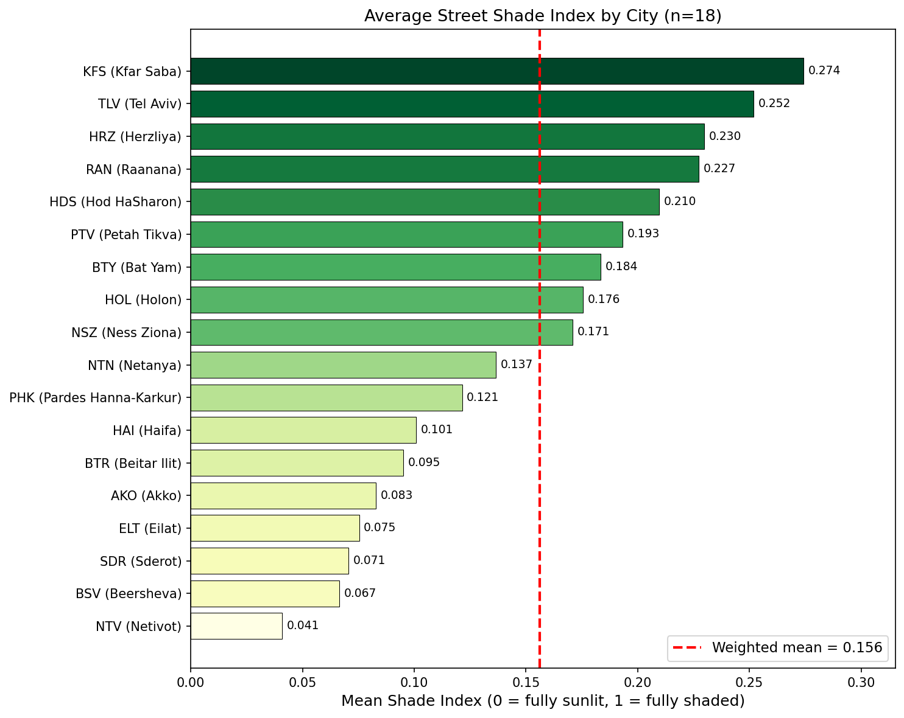
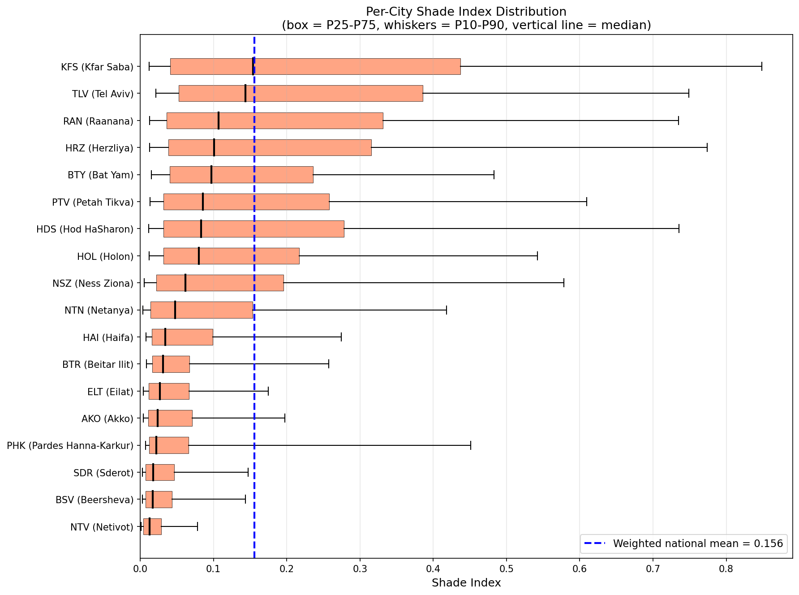
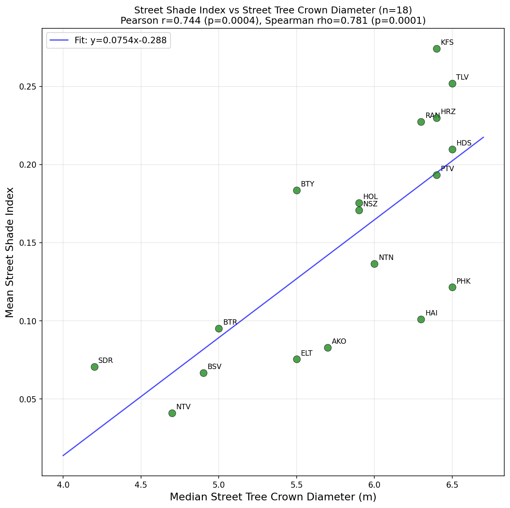
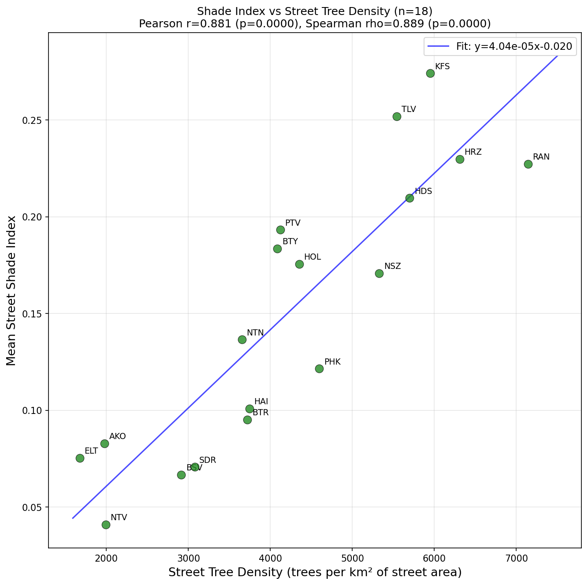

# Street Shade Index Analysis: 18 Israeli Cities

## Summary

- **Cities analyzed**: 18
- **Weighted mean Shade Index**: 0.1561
- **Most shaded streets**: KFS (Kfar Saba) at SI = 0.274
- **Least shaded streets**: NTV (Netivot) at SI = 0.041
- **Total street area analyzed**: 63.00 km2 across 252,020,274 pixels

## Methodology

### Shade Index Definition

For each raster pixel, the Shade Index is computed as:

```
SI = 1 - (pixel_kdown / city_max_kdown)
```

where `pixel_kdown` is the pixel's cumulative solar exposure (08:00-17:00 on 6 August), and `city_max_kdown` is the maximum pixel value across the entire city's raster (representing a fully unshaded reference location).

A city's **average SI** is the mean of per-pixel SI values across all raster cells that fall within the dissolved street network polygon.

- `SI = 0` means no shading (direct sunlight throughout the day)
- `SI = 1` means full shading (no direct solar exposure)
- Typical urban values: 0.1-0.5

### Data Sources

- **Solar exposure rasters**: 0.5 m/pixel cumulative kdown (6 Aug, 08:00-17:00), EPSG:2039
- **Street polygons**: dissolved street network polygons from `batch_process_streets.py`

## Per-City Shade Index



### Distribution Shape

The mean alone hides the shape of each city's SI distribution. The box plot below shows the inter-quartile range (P25-P75) and 10th-90th percentile whiskers per city, so you can see how varied or uniform the shading is across each city's street network.



### Per-City Statistics Table

| Rank | City | Name | Mean SI | P10 | P25 | Median | P75 | P90 | IQR | Street Area (km²) |
|------|------|------|--------:|----:|----:|-------:|----:|----:|----:|------------------:|
| 1 | KFS | Kfar Saba | 0.2742 | 0.012 | 0.041 | 0.154 | 0.437 | 0.848 | 0.397 | 2.44 |
| 2 | TLV | Tel Aviv | 0.2520 | 0.022 | 0.053 | 0.144 | 0.385 | 0.749 | 0.333 | 10.68 |
| 3 | HRZ | Herzliya | 0.2298 | 0.013 | 0.038 | 0.101 | 0.315 | 0.774 | 0.277 | 2.99 |
| 4 | RAN | Raanana | 0.2274 | 0.013 | 0.036 | 0.107 | 0.331 | 0.735 | 0.295 | 2.08 |
| 5 | HDS | Hod HaSharon | 0.2097 | 0.012 | 0.032 | 0.083 | 0.278 | 0.735 | 0.247 | 1.91 |
| 6 | PTV | Petah Tikva | 0.1933 | 0.013 | 0.031 | 0.085 | 0.258 | 0.609 | 0.227 | 4.54 |
| 7 | BTY | Bat Yam | 0.1836 | 0.015 | 0.040 | 0.097 | 0.236 | 0.483 | 0.196 | 1.57 |
| 8 | HOL | Holon | 0.1756 | 0.012 | 0.032 | 0.080 | 0.217 | 0.542 | 0.185 | 3.27 |
| 9 | NSZ | Ness Ziona | 0.1709 | 0.005 | 0.022 | 0.062 | 0.195 | 0.578 | 0.173 | 1.54 |
| 10 | NTN | Netanya | 0.1365 | 0.004 | 0.014 | 0.048 | 0.153 | 0.418 | 0.140 | 5.33 |
| 11 | PHK | Pardes Hanna-Karkur | 0.1215 | 0.007 | 0.012 | 0.022 | 0.066 | 0.451 | 0.054 | 1.71 |
| 12 | HAI | Haifa | 0.1009 | 0.008 | 0.016 | 0.034 | 0.099 | 0.274 | 0.083 | 7.92 |
| 13 | BTR | Beitar Ilit | 0.0952 | 0.008 | 0.017 | 0.031 | 0.067 | 0.257 | 0.051 | 0.68 |
| 14 | AKO | Akko | 0.0830 | 0.004 | 0.011 | 0.024 | 0.071 | 0.197 | 0.060 | 2.04 |
| 15 | ELT | Eilat | 0.0754 | 0.004 | 0.012 | 0.027 | 0.066 | 0.175 | 0.055 | 2.48 |
| 16 | SDR | Sderot | 0.0707 | 0.003 | 0.007 | 0.018 | 0.046 | 0.147 | 0.039 | 1.59 |
| 17 | BSV | Beersheva | 0.0666 | 0.003 | 0.007 | 0.017 | 0.044 | 0.144 | 0.036 | 8.59 |
| 18 | NTV | Netivot | 0.0409 | 0.001 | 0.004 | 0.013 | 0.028 | 0.078 | 0.024 | 1.63 |

## Correlation with Street Tree Crown Diameter



**Correlation**: Pearson r = 0.744, Spearman rho = 0.781

Interpretation: There is a **strong positive correlation** between median street tree crown diameter and street-average Shade Index. Cities with larger street trees tend to have more shaded streets, consistent with the hypothesis that tree canopy is a primary driver of street shading.

### Detailed Data

| City | Name | Median Crown Diam (m) | Mean SI |
|------|------|----------------------:|--------:|
| KFS | Kfar Saba | 6.4 | 0.2742 |
| TLV | Tel Aviv | 6.5 | 0.2520 |
| HRZ | Herzliya | 6.4 | 0.2298 |
| RAN | Raanana | 6.3 | 0.2274 |
| HDS | Hod HaSharon | 6.5 | 0.2097 |
| PTV | Petah Tikva | 6.4 | 0.1933 |
| BTY | Bat Yam | 5.5 | 0.1836 |
| HOL | Holon | 5.9 | 0.1756 |
| NSZ | Ness Ziona | 5.9 | 0.1709 |
| NTN | Netanya | 6.0 | 0.1365 |
| PHK | Pardes Hanna-Karkur | 6.5 | 0.1215 |
| HAI | Haifa | 6.3 | 0.1009 |
| BTR | Beitar Ilit | 5.0 | 0.0952 |
| AKO | Akko | 5.7 | 0.0830 |
| ELT | Eilat | 5.5 | 0.0754 |
| SDR | Sderot | 4.2 | 0.0707 |
| BSV | Beersheva | 4.9 | 0.0666 |
| NTV | Netivot | 4.7 | 0.0409 |

## Correlation with Street Tree Density



Street tree density is computed as number of street trees divided by street network area (trees per km²). This normalizes for city size, giving a fair per-unit-area comparison.

**Correlation**: Pearson r = 0.881, Spearman rho = 0.889

Interpretation: There is a **strong positive correlation** between street tree density and street-average Shade Index.

### Detailed Data

| City | Name | Street Trees | Street Area (km²) | Density (trees/km²) | Mean SI |
|------|------|-------------:|------------------:|--------------------:|--------:|
| KFS | Kfar Saba | 14,525 | 2.44 | 5,949 | 0.2742 |
| TLV | Tel Aviv | 59,208 | 10.68 | 5,542 | 0.2520 |
| HRZ | Herzliya | 18,846 | 2.99 | 6,308 | 0.2298 |
| RAN | Raanana | 14,885 | 2.08 | 7,142 | 0.2274 |
| HDS | Hod HaSharon | 10,906 | 1.91 | 5,699 | 0.2097 |
| PTV | Petah Tikva | 18,732 | 4.54 | 4,122 | 0.1933 |
| BTY | Bat Yam | 6,428 | 1.57 | 4,085 | 0.1836 |
| HOL | Holon | 14,223 | 3.27 | 4,352 | 0.1756 |
| NSZ | Ness Ziona | 8,190 | 1.54 | 5,328 | 0.1709 |
| NTN | Netanya | 19,466 | 5.33 | 3,654 | 0.1365 |
| PHK | Pardes Hanna-Karkur | 7,875 | 1.71 | 4,596 | 0.1215 |
| HAI | Haifa | 29,656 | 7.92 | 3,742 | 0.1009 |
| BTR | Beitar Ilit | 2,528 | 0.68 | 3,719 | 0.0952 |
| AKO | Akko | 4,030 | 2.04 | 1,977 | 0.0830 |
| ELT | Eilat | 4,145 | 2.48 | 1,674 | 0.0754 |
| SDR | Sderot | 4,902 | 1.59 | 3,077 | 0.0707 |
| BSV | Beersheva | 25,033 | 8.59 | 2,913 | 0.0666 |
| NTV | Netivot | 3,238 | 1.63 | 1,992 | 0.0409 |

## Limitations

1. **Raster max as reference**: The global max per city may not be a perfectly unshaded point (e.g., if the entire city is partially shaded, the max is biased downward). Using absolute solar constants would change values but not the relative ranking.
2. **Building shade vs tree shade**: SI conflates shade from buildings, trees, and topography. Cities with tall buildings (TLV) may score high for reasons unrelated to tree cover.
3. **Single date**: Analysis is for 6 August only (~peak summer). Winter or morning/afternoon patterns may differ.
4. **Street polygon accuracy**: Depends on the quality of the dissolved street network polygon (see `batch_process_streets.py`).

## Files

- `shade_index_data.xlsx` -- per-city SI data (for custom plotting); now includes
  P10/P25/P50/P75/P90 percentiles and IQR plus a dedicated `SI Percentiles` sheet
- `plots_shade_index/01_si_per_city.png` -- ranked bar chart
- `plots_shade_index/02_si_vs_crown_diameter.png` -- SI vs crown diameter
- `plots_shade_index/03_si_vs_tree_density.png` -- SI vs tree density
- `plots_shade_index/05_si_distribution_per_city.png` -- per-city SI distribution
  (box = P25-P75, whiskers = P10-P90)
