# Street Tree Quality Analysis: 18 Israeli Cities

## Summary

- **Total street trees analyzed**: 266,816
- **National mean crown diameter (street trees)**: 6.1 m
- **National median crown diameter (street trees)**: 6.2 m
- **Large street trees (>= 10m crown)**: 6.6%
- **Small street trees (< 4m crown)**: 22.3%

### Definition

A tree is classified as a "street tree" if its estimated trunk location falls inside the city's street network polygon or within **2 meters** of a street edge. This captures both trees planted in street medians/sidewalks and front-yard trees that contribute to the streetscape canopy.

### Key Findings

1. **Top 3 cities by street tree quality**: TLV (Tel Aviv), HAI (Haifa), HRZ (Herzliya)
2. **Bottom 3 cities**: ELT (Eilat), NTV (Netivot), BTR (Beitar Ilit)
3. **Largest median crown**: PHK (Pardes Hanna-Karkur) at 6.5 m
4. **Smallest median crown**: SDR (Sderot) at 4.2 m
5. **All-trees vs street-trees correlation**: Pearson r=0.914, Spearman rho=0.920

## Methodology

Street tree trunks were identified by spatial intersection of estimated trunk point locations with the dissolved street network polygon (buffered by 2m). The street network polygons were derived from parcel-level street segment data, dissolved into unified polygons with thin sliver gaps closed and small holes filled.

Crown diameter for each tree is derived from the predicted trunk count per canopy polygon: `crown_area = polygon_area / N_trees`, `crown_diameter = 2 * sqrt(crown_area / pi)`.

## National Street Tree Crown Distribution

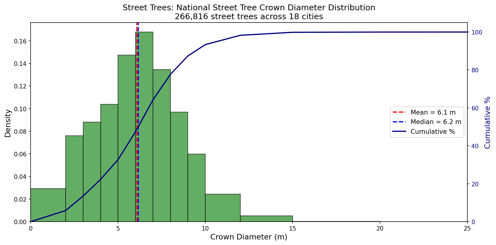

## City Rankings

### By Median Crown Diameter

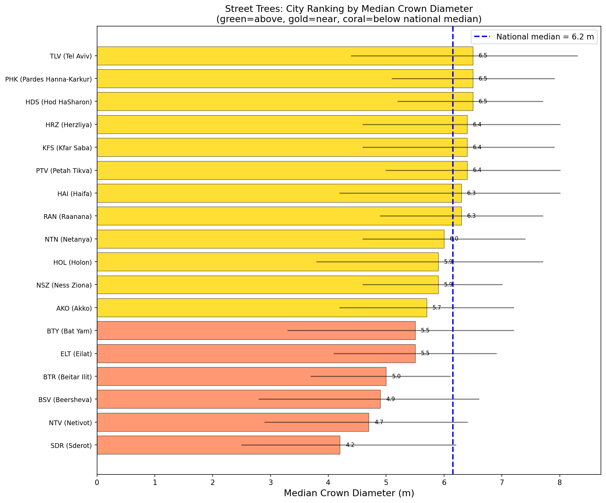

| Rank | City | Name | Median (m) | Mean (m) | IQR (m) | Street Trees |
|------|------|------|-----------|---------|---------|-------------|
| 1 | PHK | Pardes Hanna-Karkur | 6.5 | 6.6 | 2.8 | 7,875 |
| 2 | HDS | Hod HaSharon | 6.5 | 6.6 | 2.5 | 10,906 |
| 3 | TLV | Tel Aviv | 6.5 | 6.4 | 3.9 | 59,208 |
| 4 | PTV | Petah Tikva | 6.4 | 6.6 | 3.0 | 18,732 |
| 5 | KFS | Kfar Saba | 6.4 | 6.3 | 3.3 | 14,525 |
| 6 | HRZ | Herzliya | 6.4 | 6.3 | 3.4 | 18,846 |
| 7 | RAN | Raanana | 6.3 | 6.2 | 2.8 | 14,885 |
| 8 | HAI | Haifa | 6.3 | 6.2 | 3.8 | 29,656 |
| 9 | NTN | Netanya | 6.0 | 6.2 | 2.8 | 19,466 |
| 10 | NSZ | Ness Ziona | 5.9 | 6.0 | 2.4 | 8,190 |
| 11 | HOL | Holon | 5.9 | 5.9 | 3.9 | 14,223 |
| 12 | AKO | Akko | 5.7 | 5.9 | 3.0 | 4,030 |
| 13 | ELT | Eilat | 5.5 | 5.7 | 2.8 | 4,145 |
| 14 | BTY | Bat Yam | 5.5 | 5.5 | 3.9 | 6,428 |
| 15 | BTR | Beitar Ilit | 5.0 | 5.1 | 2.4 | 2,528 |
| 16 | BSV | Beersheva | 4.9 | 5.0 | 3.8 | 25,033 |
| 17 | NTV | Netivot | 4.7 | 4.9 | 3.5 | 3,238 |
| 18 | SDR | Sderot | 4.2 | 4.7 | 3.7 | 4,902 |

### By Large Tree Fraction (crown >= 10m)

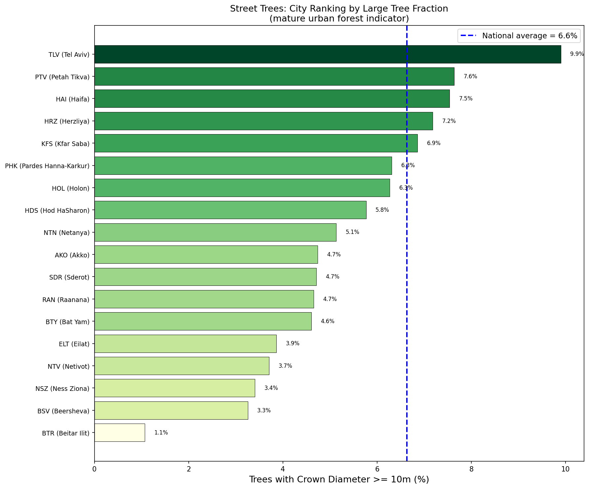

### Composite Quality Score

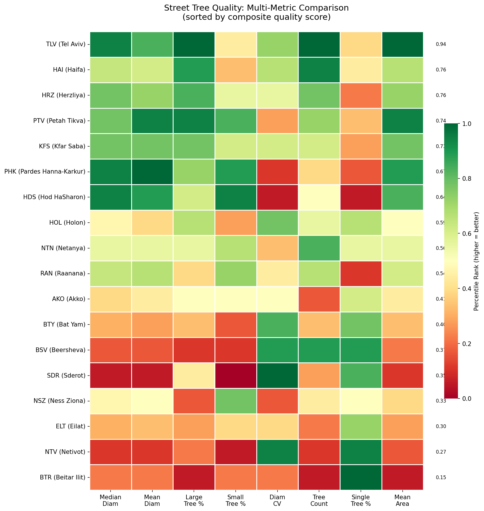

| Rank | City | Name | Quality Score | Median Diam | Large Tree % | Street Trees |
|------|------|------|--------------|------------|-------------|-------------|
| 1 | TLV | Tel Aviv | 0.936 | 6.5 m | 9.9% | 59,208 |
| 2 | HAI | Haifa | 0.764 | 6.3 m | 7.5% | 29,656 |
| 3 | HRZ | Herzliya | 0.761 | 6.4 m | 7.2% | 18,846 |
| 4 | PTV | Petah Tikva | 0.744 | 6.4 m | 7.6% | 18,732 |
| 5 | KFS | Kfar Saba | 0.728 | 6.4 m | 6.9% | 14,525 |
| 6 | PHK | Pardes Hanna-Karkur | 0.669 | 6.5 m | 6.3% | 7,875 |
| 7 | HDS | Hod HaSharon | 0.644 | 6.5 m | 5.8% | 10,906 |
| 8 | HOL | Holon | 0.589 | 5.9 m | 6.3% | 14,223 |
| 9 | NTN | Netanya | 0.564 | 6.0 m | 5.1% | 19,466 |
| 10 | RAN | Raanana | 0.539 | 6.3 m | 4.7% | 14,885 |
| 11 | AKO | Akko | 0.406 | 5.7 m | 4.7% | 4,030 |
| 12 | BTY | Bat Yam | 0.397 | 5.5 m | 4.6% | 6,428 |
| 13 | BSV | Beersheva | 0.367 | 4.9 m | 3.3% | 25,033 |
| 14 | SDR | Sderot | 0.347 | 4.2 m | 4.7% | 4,902 |
| 15 | NSZ | Ness Ziona | 0.331 | 5.9 m | 3.4% | 8,190 |
| 16 | ELT | Eilat | 0.297 | 5.5 m | 3.9% | 4,145 |
| 17 | NTV | Netivot | 0.269 | 4.7 m | 3.7% | 3,238 |
| 18 | BTR | Beitar Ilit | 0.147 | 5.0 m | 1.1% | 2,528 |

## Detailed Comparisons

### Crown Diameter Distributions

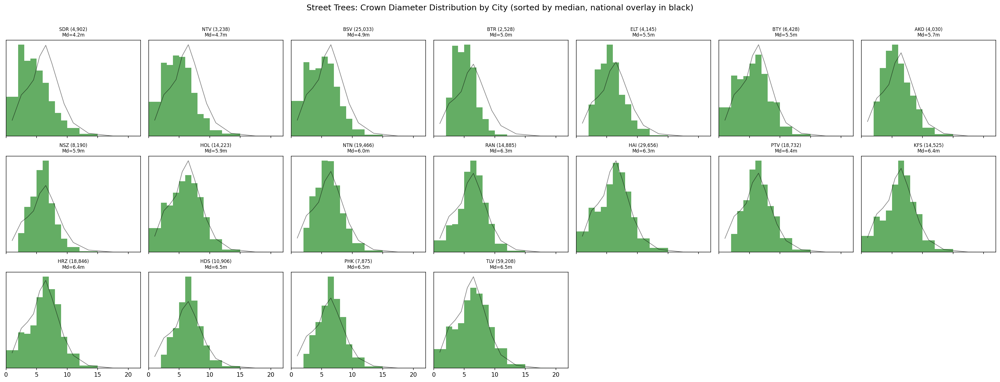

### Box Plot Comparison

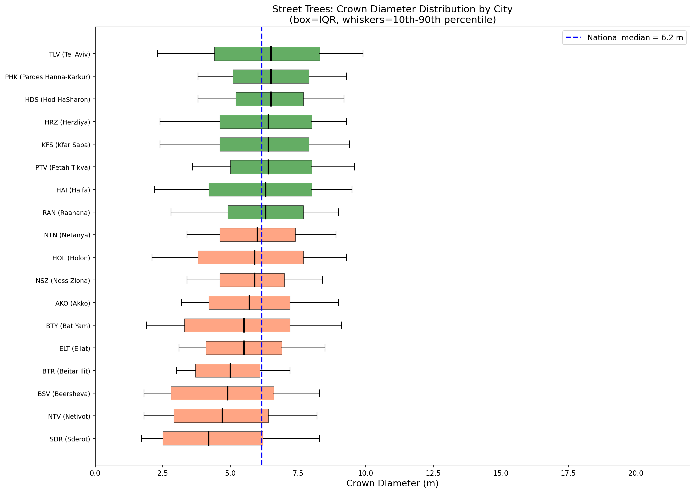

### Crown Size Class Distribution

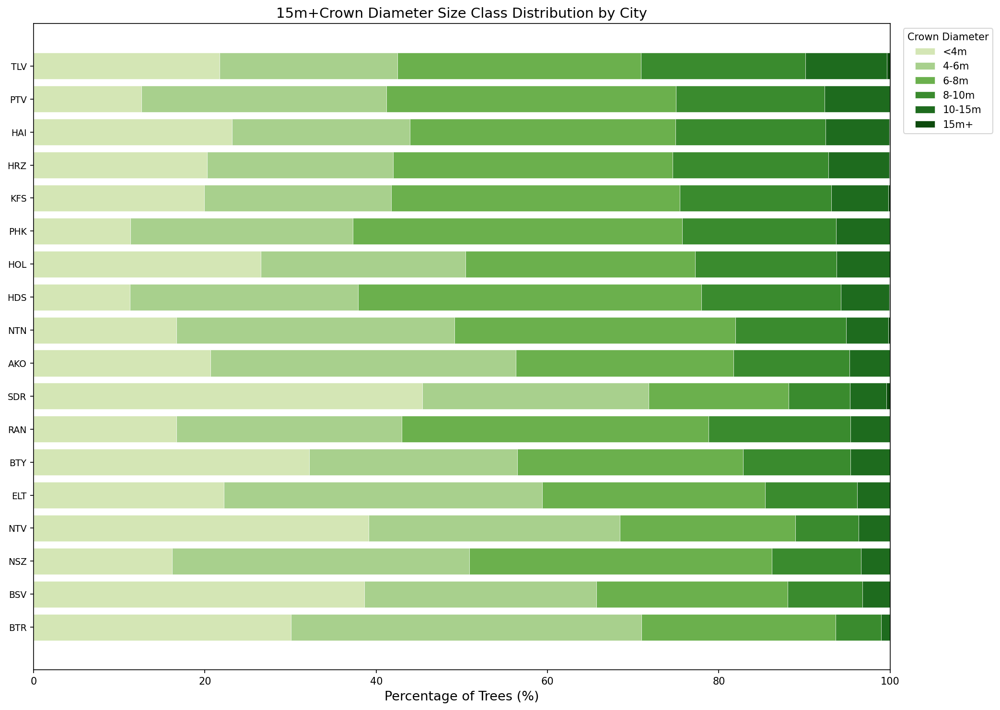

## All Trees vs Street Trees Correlation

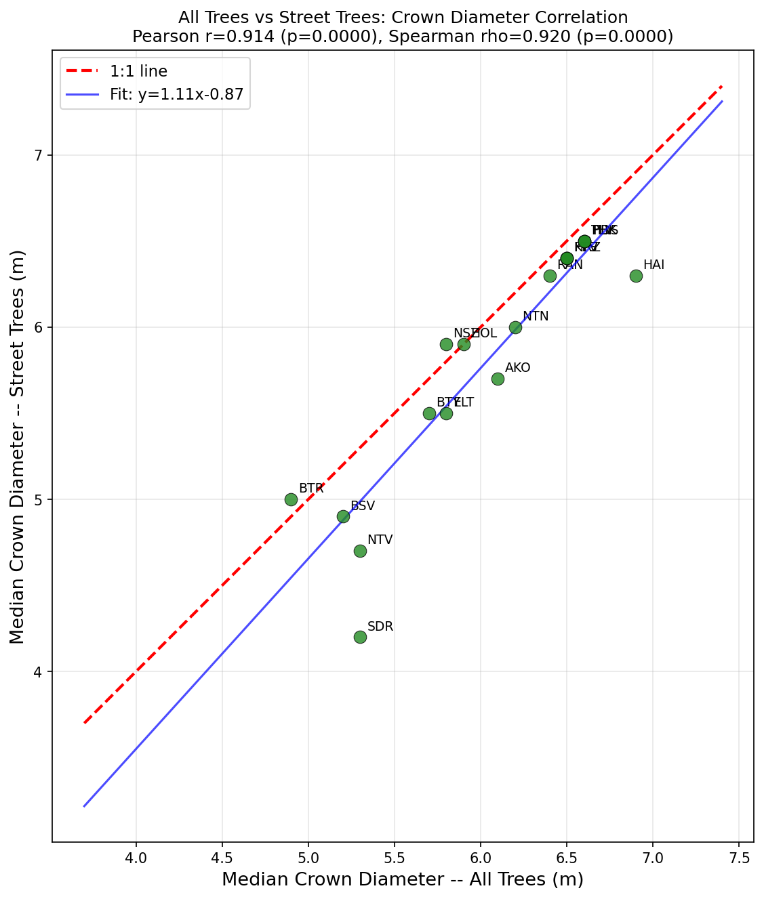

| City | All Trees Median (m) | Street Trees Median (m) | Difference (m) |
|------|---------------------|------------------------|----------------|
| HAI (Haifa) | 6.9 | 6.3 | -0.6 |
| HDS (Hod HaSharon) | 6.6 | 6.5 | -0.1 |
| TLV (Tel Aviv) | 6.6 | 6.5 | -0.1 |
| PHK (Pardes Hanna-Karkur) | 6.6 | 6.5 | -0.1 |
| HRZ (Herzliya) | 6.5 | 6.4 | -0.1 |
| PTV (Petah Tikva) | 6.5 | 6.4 | -0.1 |
| KFS (Kfar Saba) | 6.5 | 6.4 | -0.1 |
| RAN (Raanana) | 6.4 | 6.3 | -0.1 |
| NTN (Netanya) | 6.2 | 6.0 | -0.2 |
| AKO (Akko) | 6.1 | 5.7 | -0.4 |
| HOL (Holon) | 5.9 | 5.9 | +0.0 |
| ELT (Eilat) | 5.8 | 5.5 | -0.3 |
| NSZ (Ness Ziona) | 5.8 | 5.9 | +0.1 |
| BTY (Bat Yam) | 5.7 | 5.5 | -0.2 |
| SDR (Sderot) | 5.3 | 4.2 | -1.1 |
| NTV (Netivot) | 5.3 | 4.7 | -0.6 |
| BSV (Beersheva) | 5.2 | 4.9 | -0.3 |
| BTR (Beitar Ilit) | 4.9 | 5.0 | +0.1 |

**Pattern**: In 2 of 18 cities, street trees have a larger median crown diameter than the city-wide average, while in 15 cities they are smaller. This suggests street trees tend to be smaller than the overall urban forest.

## Additional Plots

### Tree Count vs Quality

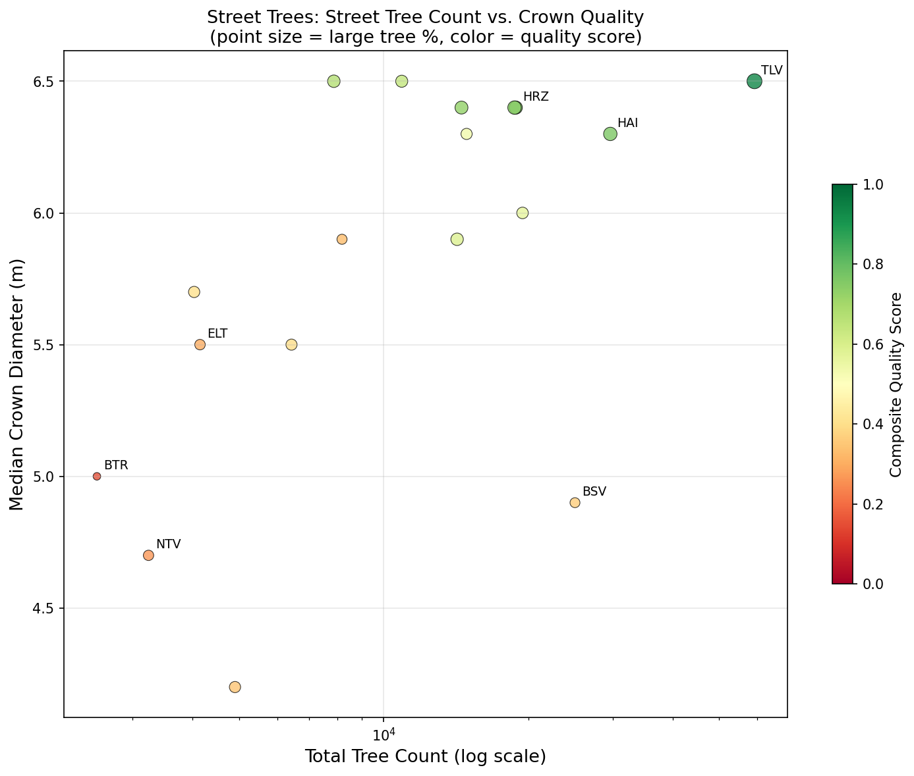

### CDF: Top vs Bottom Cities

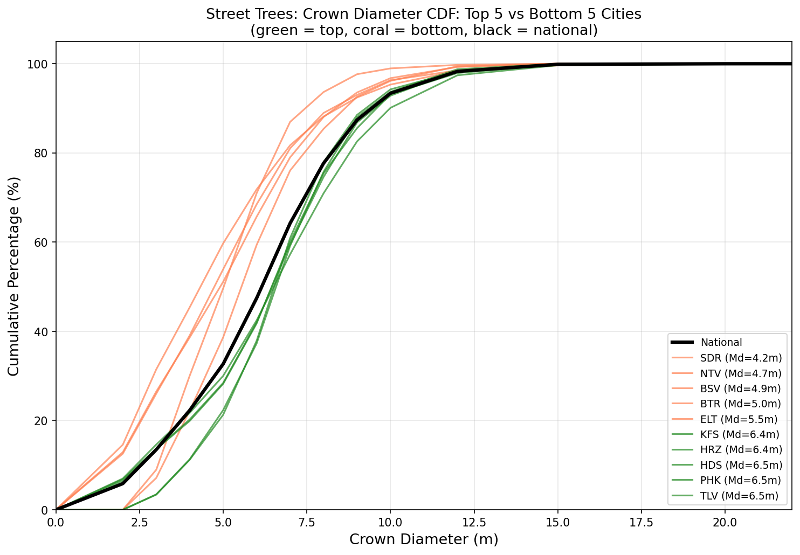

### Single-Tree vs All-Trees Estimates

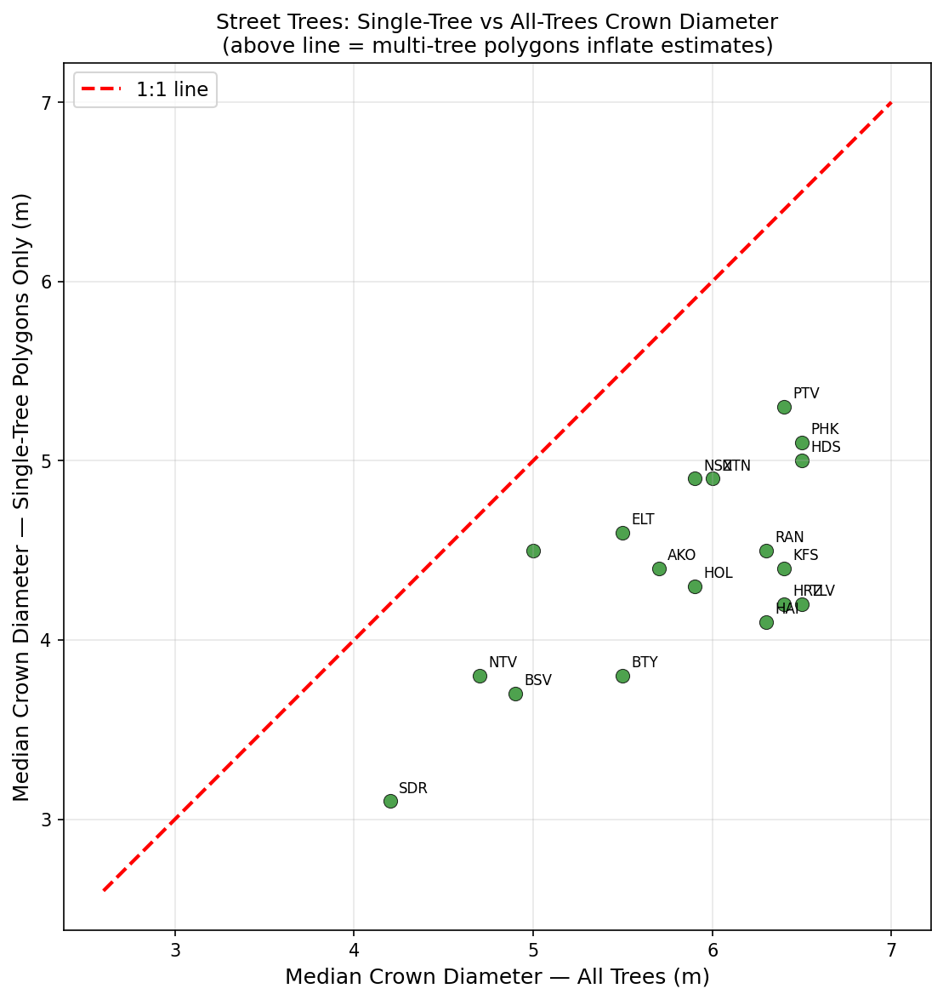

## Appendix: Full Per-City Statistics

| City | Name | Street Trees | Median Diam | Mean Diam | Std | Q25 | Q75 | Large % | Small % | CV | Quality Score |
|----|------|-------------|------------|----------|-----|-----|-----|----|-----|--|--|
| TLV | Tel Aviv | 59,208 | 6.5 | 6.4 | 2.9 | 4.4 | 8.3 | 9.9 | 21.7 | 0.45 | 0.936 |
| HAI | Haifa | 29,656 | 6.3 | 6.2 | 2.7 | 4.2 | 8.0 | 7.5 | 23.2 | 0.44 | 0.764 |
| HRZ | Herzliya | 18,846 | 6.4 | 6.3 | 2.6 | 4.6 | 8.0 | 7.2 | 20.2 | 0.41 | 0.761 |
| PTV | Petah Tikva | 18,732 | 6.4 | 6.6 | 2.2 | 5.0 | 8.0 | 7.6 | 12.6 | 0.34 | 0.744 |
| KFS | Kfar Saba | 14,525 | 6.4 | 6.3 | 2.6 | 4.6 | 7.9 | 6.9 | 19.9 | 0.42 | 0.728 |
| PHK | Pardes Hanna-Karkur | 7,875 | 6.5 | 6.6 | 2.1 | 5.1 | 7.9 | 6.3 | 11.3 | 0.32 | 0.669 |
| HDS | Hod HaSharon | 10,906 | 6.5 | 6.6 | 2.1 | 5.2 | 7.7 | 5.8 | 11.2 | 0.32 | 0.644 |
| HOL | Holon | 14,223 | 5.9 | 5.9 | 2.7 | 3.8 | 7.7 | 6.3 | 26.5 | 0.46 | 0.589 |
| NTN | Netanya | 19,466 | 6.0 | 6.2 | 2.2 | 4.6 | 7.4 | 5.1 | 16.7 | 0.36 | 0.564 |
| RAN | Raanana | 14,885 | 6.3 | 6.2 | 2.3 | 4.9 | 7.7 | 4.7 | 16.7 | 0.37 | 0.539 |
| AKO | Akko | 4,030 | 5.7 | 5.9 | 2.2 | 4.2 | 7.2 | 4.7 | 20.7 | 0.38 | 0.406 |
| BTY | Bat Yam | 6,428 | 5.5 | 5.5 | 2.6 | 3.3 | 7.2 | 4.6 | 32.2 | 0.48 | 0.397 |
| BSV | Beersheva | 25,033 | 4.9 | 5.0 | 2.5 | 2.8 | 6.6 | 3.3 | 38.6 | 0.50 | 0.367 |
| SDR | Sderot | 4,902 | 4.2 | 4.7 | 2.7 | 2.5 | 6.2 | 4.7 | 45.4 | 0.58 | 0.347 |
| NSZ | Ness Ziona | 8,190 | 5.9 | 6.0 | 1.9 | 4.6 | 7.0 | 3.4 | 16.2 | 0.32 | 0.331 |
| ELT | Eilat | 4,145 | 5.5 | 5.7 | 2.1 | 4.1 | 6.9 | 3.9 | 22.2 | 0.36 | 0.297 |
| NTV | Netivot | 3,238 | 4.7 | 4.9 | 2.5 | 2.9 | 6.4 | 3.7 | 39.1 | 0.51 | 0.269 |
| BTR | Beitar Ilit | 2,528 | 5.0 | 5.1 | 1.7 | 3.7 | 6.1 | 1.1 | 30.1 | 0.34 | 0.147 |

## Diagnostic Plots

All plots saved to `plots_street_trees/`:

1. `01_national_crown_diameter_hist.png` -- National street tree crown diameter histogram
2. `02_city_distributions_grid.png` -- Per-city distributions (small multiples)
3. `03_city_boxplots.png` -- Box plots (Q10-Q90)
4. `04_city_ranking_median_diam.png` -- City ranking by median crown diameter
5. `05_city_ranking_large_trees.png` -- City ranking by large tree fraction
6. `06_crown_size_classes_stacked.png` -- Size class proportions
7. `07_tree_count_vs_quality.png` -- Tree count vs crown quality
8. `08_quality_index_heatmap.png` -- Multi-metric quality heatmap
9. `09_national_vs_city_cdf.png` -- CDF: top 5 vs bottom 5
10. `10_single_vs_all_trees.png` -- Single-tree vs all-trees crown diameter
11. `11_all_vs_street_correlation.png` -- All trees vs street trees correlation
