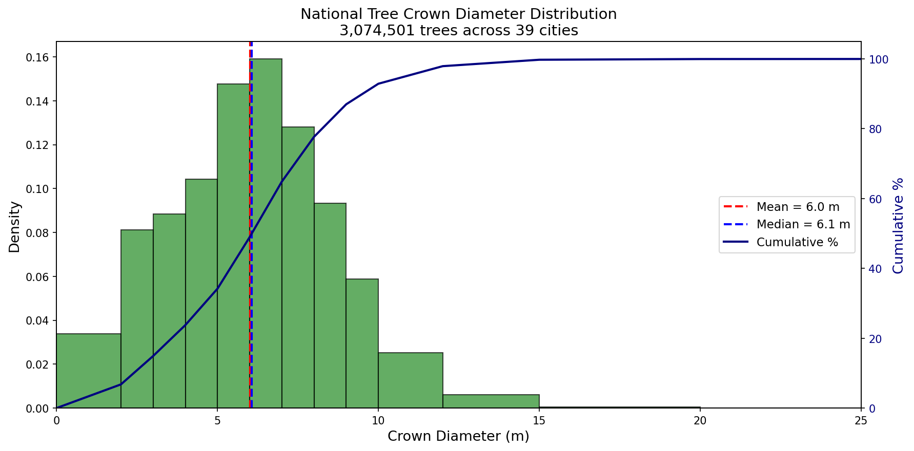
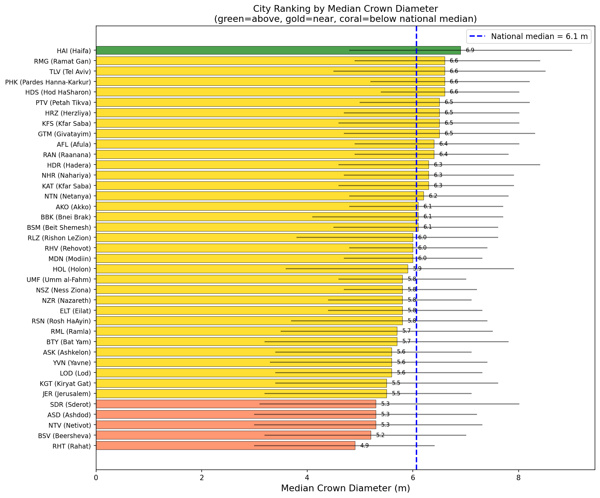
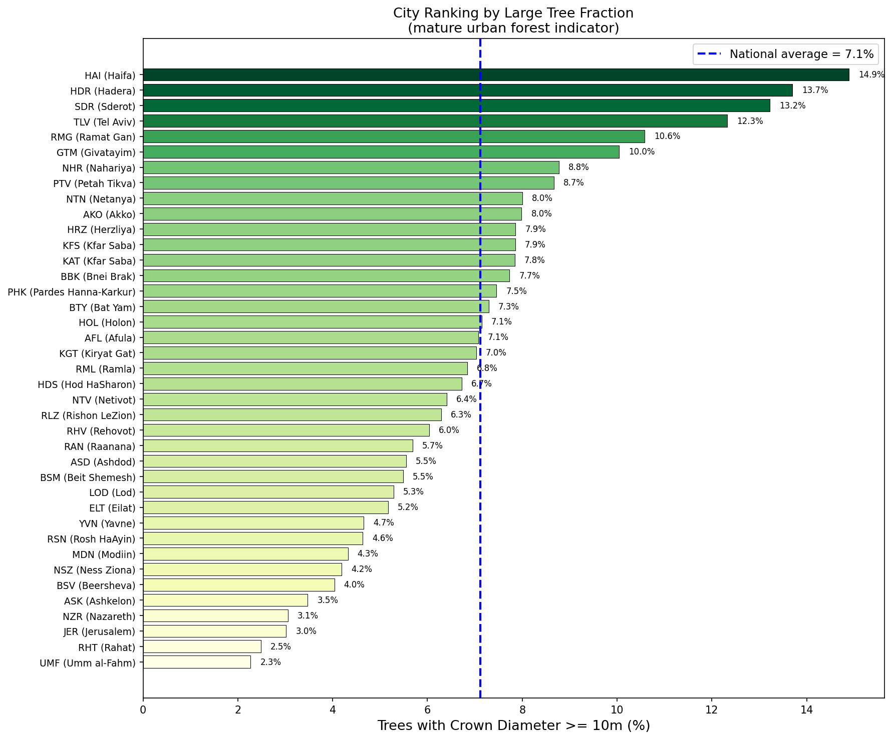
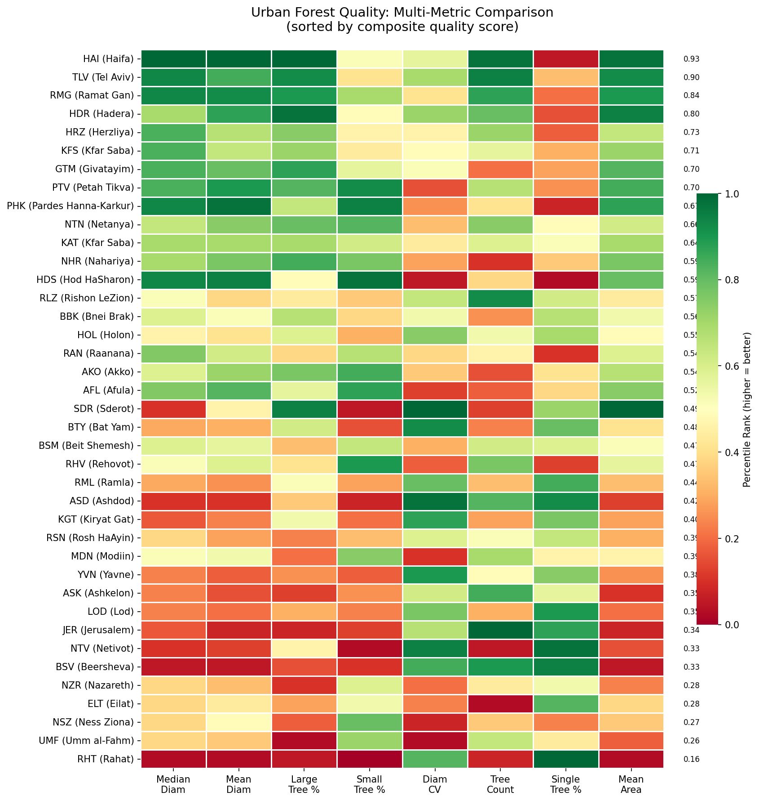
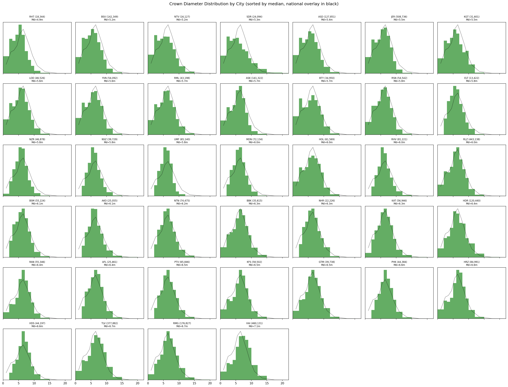
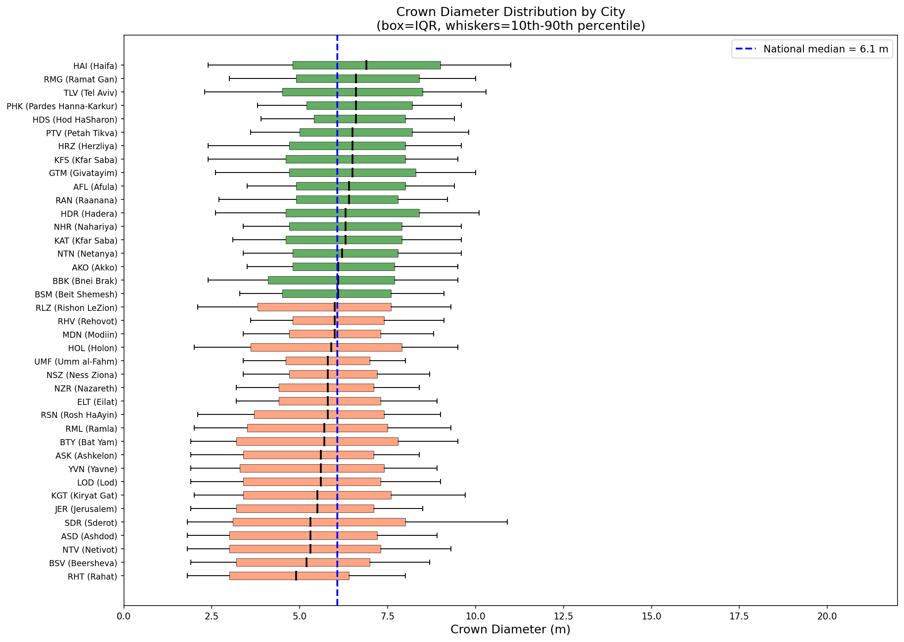
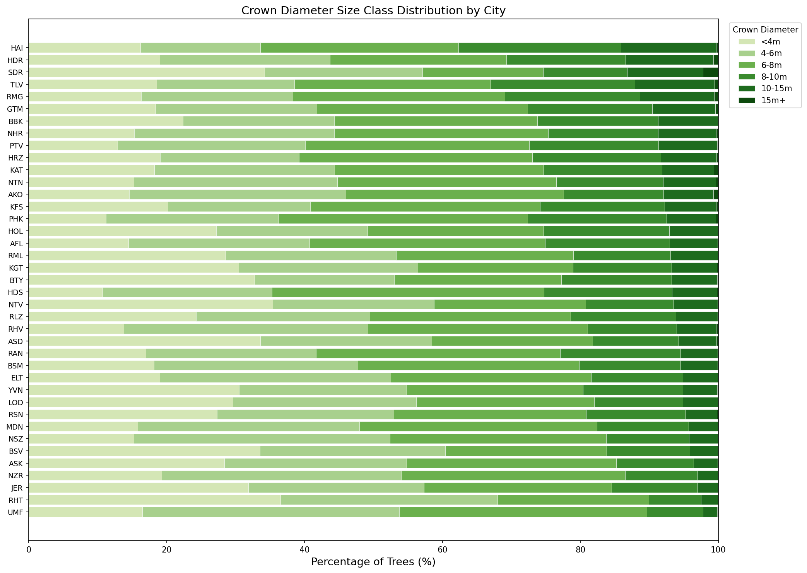
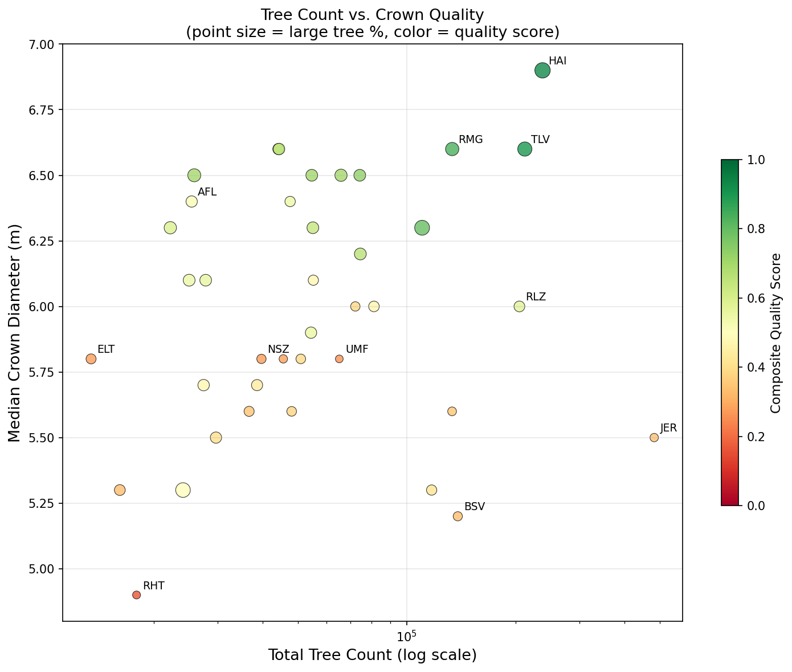
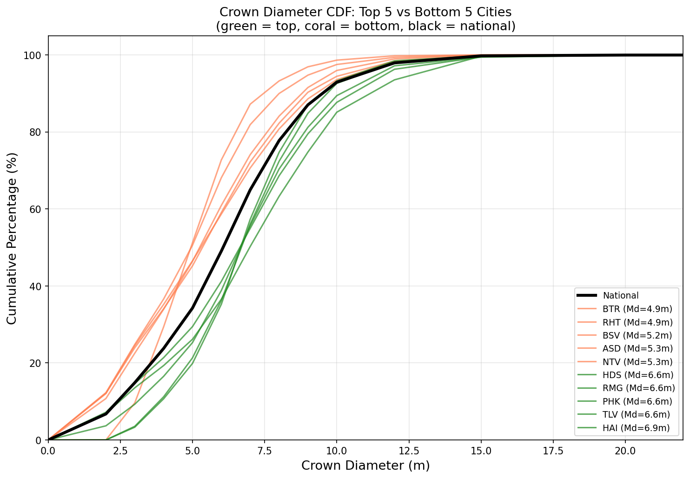
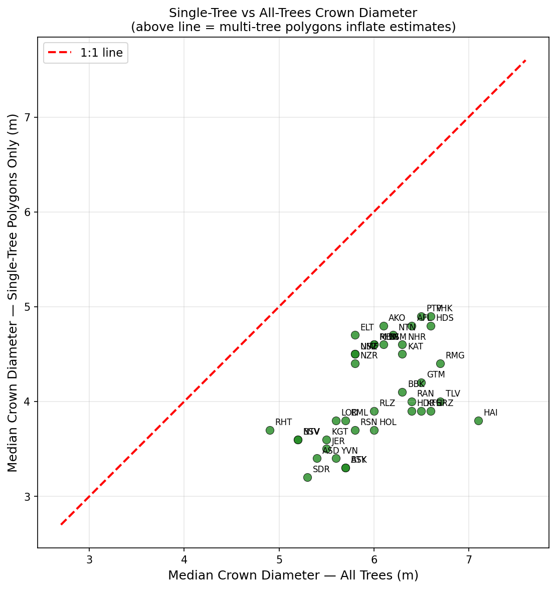

# Urban Forest Quality Analysis: 39 Israeli Cities

## Summary

- **Total trees analyzed**: 3,074,501
- **Total crown polygons**: 1,728,663
- **National mean crown diameter**: 6.0 m
- **National median crown diameter**: 6.1 m
- **Large trees (>= 10m crown)**: 7.1% nationally
- **Small trees (< 4m crown)**: 23.8% nationally

### Key Findings

1. **Top 3 cities by crown quality**: HAI (Haifa), TLV (Tel Aviv), RMG (Ramat Gan)
2. **Bottom 3 cities**: NSZ (Ness Ziona), UMF (Umm al-Fahm), RHT (Rahat)
3. **Largest median crown**: HAI (Haifa) at 6.9 m
4. **Smallest median crown**: RHT (Rahat) at 4.9 m
5. **Most large trees**: HAI (Haifa) at 14.9%

## Methodology

### Data Pipeline

Tree crown polygons were extracted from digital surface model (DSM) derived elevation data for each city. The analysis pipeline:

1. **Geometry repair**: Invalid polygons fixed, multi-parts exploded, contained polygons removed
2. **Feature extraction**: 20 morphological features computed per polygon
3. **Tree count prediction**: Polygons with area < 150 m^2 and compactness > 0.6 assigned 1 tree; remaining polygons predicted using Ridge regression (R2=0.736)
4. **Point generation**: Tree trunk locations placed via constrained k-means inside each polygon

### Crown Diameter Derivation

For each polygon with predicted N trees:
- Crown area per tree = polygon area / N
- Crown diameter = 2 * sqrt(crown_area / pi) (equivalent circular diameter)

### Quality Definition

Urban forest quality is assessed by crown diameter as a proxy for tree maturity and canopy development. Larger crown diameters indicate:
- More mature trees with greater ecosystem services
- Better growing conditions (soil, water, space)
- Higher canopy coverage and shade provision

A **composite quality score** combines: median crown diameter (40%), large tree fraction (30%), crown diameter diversity/CV (15%), and total tree count (15%).

## National Crown Diameter Distribution

The national distribution is right-skewed, with most trees in the 4-8m crown diameter range. The median (6.1 m) is slightly below the mean (6.0 m), reflecting the tail of very large crown polygons.

## City Rankings

### By Median Crown Diameter

| Rank | City | Name | Median (m) | Mean (m) | IQR (m) | Trees |
|------|------|------|-----------|---------|---------|-------|
| 1 | HAI | Haifa | 6.9 | 6.9 | 4.2 | 237,438 |
| 2 | HDS | Hod HaSharon | 6.6 | 6.7 | 2.6 | 44,197 |
| 3 | RMG | Ramat Gan | 6.6 | 6.7 | 3.5 | 133,621 |
| 4 | PHK | Pardes Hanna-Karkur | 6.6 | 6.8 | 3.0 | 44,381 |
| 5 | TLV | Tel Aviv | 6.6 | 6.6 | 4.0 | 212,127 |
| 6 | KFS | Kfar Saba | 6.5 | 6.3 | 3.4 | 54,672 |
| 7 | HRZ | Herzliya | 6.5 | 6.4 | 3.3 | 74,202 |
| 8 | PTV | Petah Tikva | 6.5 | 6.7 | 3.2 | 65,850 |
| 9 | GTM | Givatayim | 6.5 | 6.5 | 3.6 | 25,886 |
| 10 | AFL | Afula | 6.4 | 6.5 | 3.1 | 25,462 |
| 11 | RAN | Raanana | 6.4 | 6.3 | 2.9 | 47,642 |
| 12 | NHR | Nahariya | 6.3 | 6.5 | 3.2 | 22,227 |
| 13 | HDR | Hadera | 6.3 | 6.6 | 3.8 | 110,331 |
| 14 | KAT | Kfar Saba | 6.3 | 6.4 | 3.3 | 55,064 |
| 15 | NTN | Netanya | 6.2 | 6.5 | 3.0 | 74,475 |
| 16 | BBK | Bnei Brak | 6.1 | 6.0 | 3.6 | 27,837 |
| 17 | AKO | Akko | 6.1 | 6.4 | 2.9 | 25,055 |
| 18 | BSM | Beit Shemesh | 6.1 | 6.2 | 3.1 | 55,227 |
| 19 | MDN | Modiin | 6.0 | 6.1 | 2.6 | 72,138 |
| 20 | RLZ | Rishon LeZion | 6.0 | 5.9 | 3.8 | 204,934 |
| 21 | RHV | Rehovot | 6.0 | 6.3 | 2.6 | 81,213 |
| 22 | HOL | Holon | 5.9 | 5.9 | 4.3 | 54,416 |
| 23 | UMF | Umm al-Fahm | 5.8 | 5.8 | 2.4 | 65,144 |
| 24 | ELT | Eilat | 5.8 | 6.0 | 2.9 | 13,423 |
| 25 | NSZ | Ness Ziona | 5.8 | 6.0 | 2.5 | 39,693 |
| 26 | NZR | Nazareth | 5.8 | 5.8 | 2.7 | 45,620 |
| 27 | RSN | Rosh HaAyin | 5.8 | 5.7 | 3.7 | 50,990 |
| 28 | RML | Ramla | 5.7 | 5.7 | 4.0 | 38,602 |
| 29 | BTY | Bat Yam | 5.7 | 5.7 | 4.6 | 27,475 |
| 30 | ASK | Ashkelon | 5.6 | 5.4 | 3.7 | 133,531 |
| 31 | YVN | Yavne | 5.6 | 5.5 | 4.1 | 48,110 |
| 32 | LOD | Lod | 5.6 | 5.5 | 3.9 | 36,696 |
| 33 | KGT | Kiryat Gat | 5.5 | 5.6 | 4.2 | 29,718 |
| 34 | JER | Jerusalem | 5.5 | 5.3 | 3.9 | 483,247 |
| 35 | ASD | Ashdod | 5.3 | 5.4 | 4.2 | 117,238 |
| 36 | SDR | Sderot | 5.3 | 6.0 | 4.9 | 24,094 |
| 37 | NTV | Netivot | 5.3 | 5.4 | 4.3 | 16,118 |
| 38 | BSV | Beersheva | 5.2 | 5.3 | 3.8 | 138,478 |
| 39 | RHT | Rahat | 4.9 | 4.9 | 3.4 | 17,929 |

### By Large Tree Fraction (crown >= 10m)

### Composite Urban Forest Quality Score

| Rank | City | Name | Quality Score | Median Diam | Large Tree % | Trees |
|------|------|------|--------------|------------|-------------|-------|
| 1 | HAI | Haifa | 0.931 | 6.9 m | 14.9% | 237,438 |
| 2 | TLV | Tel Aviv | 0.897 | 6.6 m | 12.3% | 212,127 |
| 3 | RMG | Ramat Gan | 0.836 | 6.6 m | 10.6% | 133,621 |
| 4 | HDR | Hadera | 0.796 | 6.3 m | 13.7% | 110,331 |
| 5 | HRZ | Herzliya | 0.733 | 6.5 m | 7.9% | 74,202 |
| 6 | KFS | Kfar Saba | 0.706 | 6.5 m | 7.9% | 54,672 |
| 7 | GTM | Givatayim | 0.703 | 6.5 m | 10.0% | 25,886 |
| 7 | PTV | Petah Tikva | 0.703 | 6.5 m | 8.7% | 65,850 |
| 9 | PHK | Pardes Hanna-Karkur | 0.667 | 6.6 m | 7.5% | 44,381 |
| 10 | NTN | Netanya | 0.656 | 6.2 m | 8.0% | 74,475 |
| 11 | KAT | Kfar Saba | 0.638 | 6.3 m | 7.8% | 55,064 |
| 12 | NHR | Nahariya | 0.588 | 6.3 m | 8.8% | 22,227 |
| 13 | HDS | Hod HaSharon | 0.586 | 6.6 m | 6.7% | 44,197 |
| 14 | RLZ | Rishon LeZion | 0.571 | 6.0 m | 6.3% | 204,934 |
| 15 | BBK | Bnei Brak | 0.555 | 6.1 m | 7.7% | 27,837 |
| 16 | HOL | Holon | 0.554 | 5.9 m | 7.1% | 54,416 |
| 17 | RAN | Raanana | 0.545 | 6.4 m | 5.7% | 47,642 |
| 18 | AKO | Akko | 0.544 | 6.1 m | 8.0% | 25,055 |
| 19 | AFL | Afula | 0.518 | 6.4 m | 7.1% | 25,462 |
| 20 | SDR | Sderot | 0.495 | 5.3 m | 13.2% | 24,094 |
| 21 | BTY | Bat Yam | 0.476 | 5.7 m | 7.3% | 27,475 |
| 22 | BSM | Beit Shemesh | 0.474 | 6.1 m | 5.5% | 55,227 |
| 23 | RHV | Rehovot | 0.471 | 6.0 m | 6.0% | 81,213 |
| 24 | RML | Ramla | 0.441 | 5.7 m | 6.8% | 38,602 |
| 25 | ASD | Ashdod | 0.418 | 5.3 m | 5.5% | 117,238 |
| 26 | KGT | Kiryat Gat | 0.401 | 5.5 m | 7.0% | 29,718 |
| 27 | RSN | Rosh HaAyin | 0.388 | 5.8 m | 4.6% | 50,990 |
| 28 | MDN | Modiin | 0.386 | 6.0 m | 4.3% | 72,138 |
| 29 | YVN | Yavne | 0.377 | 5.6 m | 4.7% | 48,110 |
| 30 | ASK | Ashkelon | 0.350 | 5.6 m | 3.5% | 133,531 |
| 31 | LOD | Lod | 0.346 | 5.6 m | 5.3% | 36,696 |
| 32 | JER | Jerusalem | 0.340 | 5.5 m | 3.0% | 483,247 |
| 33 | NTV | Netivot | 0.329 | 5.3 m | 6.4% | 16,118 |
| 34 | BSV | Beersheva | 0.328 | 5.2 m | 4.0% | 138,478 |
| 35 | NZR | Nazareth | 0.281 | 5.8 m | 3.1% | 45,620 |
| 36 | ELT | Eilat | 0.277 | 5.8 m | 5.2% | 13,423 |
| 37 | NSZ | Ness Ziona | 0.273 | 5.8 m | 4.2% | 39,693 |
| 38 | UMF | Umm al-Fahm | 0.262 | 5.8 m | 2.3% | 65,144 |
| 39 | RHT | Rahat | 0.160 | 4.9 m | 2.5% | 17,929 |

## Detailed City Comparisons

### Crown Diameter Distributions

### Box Plot Comparison

### Crown Size Class Distribution

## Correlations and Patterns

### Tree Count vs Quality

### CDF Comparison: Top and Bottom Cities

### Single-Tree vs All-Trees Estimates

Points above the 1:1 line indicate cities where multi-tree polygon estimates inflate the median crown diameter. Points near or on the line suggest the multi-tree estimates are consistent with single-tree measurements.

## Data Quality Notes

### Single-Tree Polygon Fraction

The fraction of trees originating from single-tree polygons (pred_trees=1) varies by city. Higher single-tree fractions produce more reliable crown diameter estimates.

| City | Single-Tree Fraction | Note |
|------|---------------------|------|
| HDS | 30.7% | Low -- many merged canopies |
| HAI | 34.2% | Low -- many merged canopies |
| PHK | 34.3% | Low -- many merged canopies |
| RAN | 35.7% | Low -- many merged canopies |
| RHV | 36.5% | Low -- many merged canopies |
| HDR | 37.1% | Low -- many merged canopies |
| HRZ | 38.0% | Low -- many merged canopies |
| RMG | 38.0% | Low -- many merged canopies |
| NSZ | 38.4% | Low -- many merged canopies |
| PTV | 39.7% | Low -- many merged canopies |
| GTM | 39.9% | Low -- many merged canopies |
| KFS | 40.1% | Low -- many merged canopies |
| TLV | 40.3% | Low -- many merged canopies |
| NHR | 41.1% | Low -- many merged canopies |
| AFL | 41.6% | Low -- many merged canopies |
| AKO | 41.7% | Low -- many merged canopies |
| UMF | 42.1% | Low -- many merged canopies |
| MDN | 42.3% | Low -- many merged canopies |
| NTN | 42.8% | Low -- many merged canopies |
| KAT | 44.2% | Low -- many merged canopies |
| NZR | 44.9% | Low -- many merged canopies |
| ASK | 46.8% | Low -- many merged canopies |
| BSM | 47.3% | Low -- many merged canopies |
| RLZ | 48.5% | Low -- many merged canopies |
| RSN | 49.3% | Low -- many merged canopies |
| BBK | 49.4% | Low -- many merged canopies |
| HOL | 51.5% | Low -- many merged canopies |
| SDR | 51.7% | Low -- many merged canopies |
| YVN | 52.2% | Low -- many merged canopies |
| KGT | 53.0% | Low -- many merged canopies |
| BTY | 54.2% | Low -- many merged canopies |
| ELT | 54.2% | Low -- many merged canopies |
| RML | 55.0% | Low -- many merged canopies |
| JER | 56.0% | Low -- many merged canopies |
| LOD | 56.3% | Low -- many merged canopies |
| ASD | 56.9% | Low -- many merged canopies |
| BSV | 59.9% | Low -- many merged canopies |
| NTV | 62.4% |  |
| RHT | 67.3% |  |

### Outlier Detection

Cities with 99th percentile crown diameter > 25m may contain artifacts from large single-prediction polygons:

No cities have 99th percentile > 25m.

### Limitations

1. Crown diameter is derived from predicted tree counts -- prediction errors propagate to crown size estimates
2. Multi-tree polygons split crown area equally among predicted trees (assumes uniform crown sizes within a cluster)
3. The single-tree filter (area < 150m^2, compactness > 0.6) may misclassify some small multi-tree clusters as single trees
4. No species information is available -- crown size variation across species is not accounted for
5. Temporal variation: most data is from 2022 orthophotos; SDR uses 2025 data

## Appendix: Full Per-City Statistics

| City | Name | Trees | Polygons | Median Diam | Mean Diam | Std | Q25 | Q75 | Large % | Small % | CV | Single % | Quality Score |
|----|------|-------|----------|------------|----------|-----|-----|-----|----|-----|--|--|--|
| HAI | Haifa | 237,438 | 100,523 | 6.9 | 6.9 | 3.1 | 4.8 | 9.0 | 14.9 | 19.3 | 0.45 | 34 | 0.931 |
| TLV | Tel Aviv | 212,127 | 106,726 | 6.6 | 6.6 | 3.0 | 4.5 | 8.5 | 12.3 | 21.4 | 0.46 | 40 | 0.897 |
| RMG | Ramat Gan | 133,621 | 66,203 | 6.6 | 6.7 | 2.7 | 4.9 | 8.4 | 10.6 | 16.5 | 0.41 | 38 | 0.836 |
| HDR | Hadera | 110,331 | 51,501 | 6.3 | 6.6 | 3.1 | 4.6 | 8.4 | 13.7 | 19.4 | 0.47 | 37 | 0.796 |
| HRZ | Herzliya | 74,202 | 36,361 | 6.5 | 6.4 | 2.7 | 4.7 | 8.0 | 7.9 | 19.8 | 0.42 | 38 | 0.733 |
| KFS | Kfar Saba | 54,672 | 27,931 | 6.5 | 6.3 | 2.7 | 4.6 | 8.0 | 7.9 | 20.3 | 0.43 | 40 | 0.706 |
| GTM | Givatayim | 25,886 | 13,323 | 6.5 | 6.5 | 2.8 | 4.7 | 8.3 | 10.0 | 19.0 | 0.43 | 40 | 0.703 |
| PTV | Petah Tikva | 65,850 | 34,677 | 6.5 | 6.7 | 2.3 | 5.0 | 8.2 | 8.7 | 12.9 | 0.35 | 40 | 0.703 |
| PHK | Pardes Hanna-Karkur | 44,381 | 20,858 | 6.6 | 6.8 | 2.4 | 5.2 | 8.2 | 7.5 | 11.2 | 0.36 | 34 | 0.667 |
| NTN | Netanya | 74,475 | 41,133 | 6.2 | 6.5 | 2.4 | 4.8 | 7.8 | 8.0 | 15.2 | 0.37 | 43 | 0.656 |
| KAT | Kfar Saba | 55,064 | 30,524 | 6.3 | 6.4 | 2.6 | 4.6 | 7.9 | 7.8 | 18.2 | 0.41 | 44 | 0.638 |
| NHR | Nahariya | 22,227 | 11,723 | 6.3 | 6.5 | 2.4 | 4.7 | 7.9 | 8.8 | 15.3 | 0.37 | 41 | 0.588 |
| HDS | Hod HaSharon | 44,197 | 19,039 | 6.6 | 6.7 | 2.1 | 5.4 | 8.0 | 6.7 | 10.7 | 0.32 | 31 | 0.586 |
| RLZ | Rishon LeZion | 204,934 | 119,784 | 6.0 | 5.9 | 2.7 | 3.8 | 7.6 | 6.3 | 26.3 | 0.46 | 48 | 0.571 |
| BBK | Bnei Brak | 27,837 | 16,871 | 6.1 | 6.0 | 2.7 | 4.1 | 7.7 | 7.7 | 24.1 | 0.44 | 49 | 0.555 |
| HOL | Holon | 54,416 | 33,452 | 5.9 | 5.9 | 2.8 | 3.6 | 7.9 | 7.1 | 27.7 | 0.47 | 51 | 0.554 |
| RAN | Raanana | 47,642 | 22,602 | 6.4 | 6.3 | 2.4 | 4.9 | 7.8 | 5.7 | 17.5 | 0.39 | 36 | 0.545 |
| AKO | Akko | 25,055 | 13,045 | 6.1 | 6.4 | 2.4 | 4.8 | 7.7 | 8.0 | 14.5 | 0.38 | 42 | 0.544 |
| AFL | Afula | 25,462 | 13,684 | 6.4 | 6.5 | 2.2 | 4.9 | 8.0 | 7.1 | 14.5 | 0.34 | 42 | 0.518 |
| SDR | Sderot | 24,094 | 14,832 | 5.3 | 6.0 | 4.7 | 3.1 | 8.0 | 13.2 | 34.2 | 0.78 | 52 | 0.495 |
| BTY | Bat Yam | 27,475 | 17,443 | 5.7 | 5.7 | 2.9 | 3.2 | 7.8 | 7.3 | 31.5 | 0.50 | 54 | 0.476 |
| BSM | Beit Shemesh | 55,227 | 32,185 | 6.1 | 6.2 | 2.3 | 4.5 | 7.6 | 5.5 | 18.2 | 0.37 | 47 | 0.474 |
| RHV | Rehovot | 81,213 | 39,190 | 6.0 | 6.3 | 2.2 | 4.8 | 7.4 | 6.0 | 13.8 | 0.35 | 37 | 0.471 |
| RML | Ramla | 38,602 | 25,331 | 5.7 | 5.7 | 2.7 | 3.5 | 7.5 | 6.8 | 28.7 | 0.48 | 55 | 0.441 |
| ASD | Ashdod | 117,238 | 77,555 | 5.3 | 5.4 | 2.8 | 3.0 | 7.2 | 5.5 | 34.1 | 0.52 | 57 | 0.418 |
| KGT | Kiryat Gat | 29,718 | 18,470 | 5.5 | 5.6 | 2.7 | 3.4 | 7.6 | 7.0 | 30.6 | 0.49 | 53 | 0.401 |
| RSN | Rosh HaAyin | 50,990 | 30,349 | 5.8 | 5.7 | 2.6 | 3.7 | 7.4 | 4.6 | 26.9 | 0.45 | 49 | 0.388 |
| MDN | Modiin | 72,138 | 38,770 | 6.0 | 6.1 | 2.0 | 4.7 | 7.3 | 4.3 | 15.8 | 0.33 | 42 | 0.386 |
| YVN | Yavne | 48,110 | 29,668 | 5.6 | 5.5 | 2.8 | 3.3 | 7.4 | 4.7 | 30.6 | 0.50 | 52 | 0.377 |
| ASK | Ashkelon | 133,531 | 74,086 | 5.6 | 5.4 | 2.5 | 3.4 | 7.1 | 3.5 | 29.5 | 0.46 | 47 | 0.350 |
| LOD | Lod | 36,696 | 24,550 | 5.6 | 5.5 | 2.6 | 3.4 | 7.3 | 5.3 | 29.9 | 0.47 | 56 | 0.346 |
| JER | Jerusalem | 483,247 | 315,946 | 5.5 | 5.3 | 2.5 | 3.2 | 7.1 | 3.0 | 32.0 | 0.46 | 56 | 0.340 |
| NTV | Netivot | 16,118 | 11,437 | 5.3 | 5.4 | 2.8 | 3.0 | 7.3 | 6.4 | 35.2 | 0.52 | 62 | 0.329 |
| BSV | Beersheva | 138,478 | 95,956 | 5.2 | 5.3 | 2.6 | 3.2 | 7.0 | 4.0 | 34.0 | 0.49 | 60 | 0.328 |
| NZR | Nazareth | 45,620 | 25,819 | 5.8 | 5.8 | 2.1 | 4.4 | 7.1 | 3.1 | 18.9 | 0.35 | 45 | 0.281 |
| ELT | Eilat | 13,423 | 8,859 | 5.8 | 6.0 | 2.1 | 4.4 | 7.3 | 5.2 | 19.0 | 0.36 | 54 | 0.277 |
| NSZ | Ness Ziona | 39,693 | 19,987 | 5.8 | 6.0 | 2.0 | 4.7 | 7.2 | 4.2 | 15.3 | 0.33 | 38 | 0.273 |
| UMF | Umm al-Fahm | 65,144 | 34,578 | 5.8 | 5.8 | 1.8 | 4.6 | 7.0 | 2.3 | 16.5 | 0.32 | 42 | 0.262 |
| RHT | Rahat | 17,929 | 13,692 | 4.9 | 4.9 | 2.4 | 3.0 | 6.4 | 2.5 | 36.6 | 0.48 | 67 | 0.160 |

## Diagnostic Plots

All plots saved to `plots_urban_forest/`:

1. `01_national_crown_diameter_hist.png` -- National crown diameter histogram with CDF
2. `02_city_distributions_grid.png` -- Small multiples: per-city distributions
3. `03_city_boxplots.png` -- Box plots (Q10-Q90) sorted by median
4. `04_city_ranking_median_diam.png` -- City ranking by median crown diameter
5. `05_city_ranking_large_trees.png` -- City ranking by large tree fraction
6. `06_crown_size_classes_stacked.png` -- Size class proportions per city
7. `07_tree_count_vs_quality.png` -- Tree count vs crown quality scatter
8. `08_quality_index_heatmap.png` -- Multi-metric quality heatmap
9. `09_national_vs_city_cdf.png` -- CDF: top 5 vs bottom 5 cities
10. `10_single_vs_all_trees.png` -- Single-tree vs all-trees crown diameter
